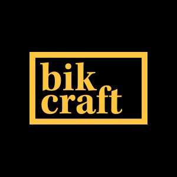

# Bikcraft

  <a href="#-tecnologias">Tecnologias</a>&nbsp;&nbsp;&nbsp;|&nbsp;&nbsp;&nbsp;
  <a href="#-projeto">Projeto</a>&nbsp;&nbsp;&nbsp;|&nbsp;&nbsp;&nbsp;
  <a href="#-layout">Layout</a>

 

  

## 🚀 Tecnologias

Esse projeto foi desenvolvido com as seguintes tecnologias:

- HTML
- CSS
- Media Queries (Responsivo)
- Javascript
- PHP

Bibliotecas

- [PHPMailer](https://github.com/PHPMailer/PHPMailer)
- [Jquery](https://jquery.com/)
- [ResponsiveSlides.js](http://responsiveslides.com/)
- [Animate.css](https://animate.style/)

## 💻 Projeto

O Bikcraft é um projeto criado a partir do curso de desenvolvimento web completo feito pela Origamid, onde teve como abordagem os primeiros passos com HTML, mostrando as principais tags e também como utilizar de forma semântica, CSS para dar o estilo das páginas e também a estruturação do layout tanto para desktop, quanto para o mobile e Javascript junto com Jquery para dar interatividade com as páginas criadas durante o curso. PHP também foi utilizado para mostrar como fazer envios de formulários utilizando o PHPMailer.

## 🔖 Layout

Você pode visualizar o projeto final através [desse link](https://github.com/LucasMengue/bikcraft).
